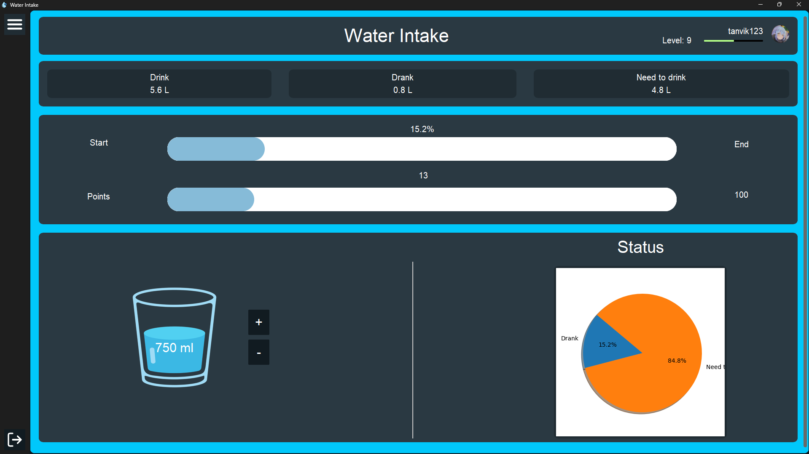
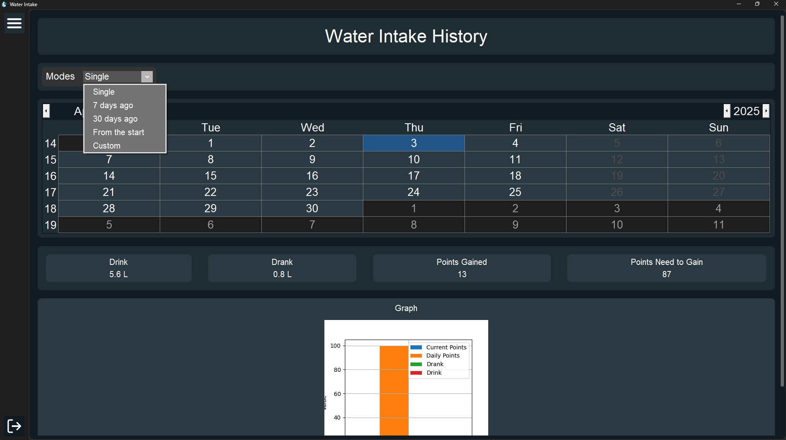
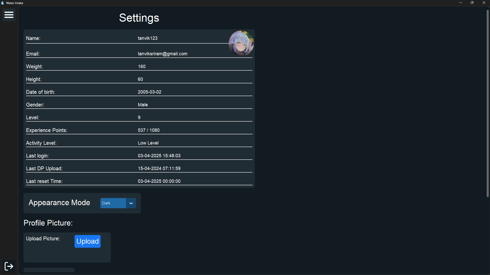

# Water Intake for Optimal Hydration

## 📌 Overview
The **Water Intake for Optimal Hydration** project is a user-friendly desktop application designed to help individuals effectively manage their daily water consumption. With a **clean and intuitive graphical interface**, users can register, log in, and track their water intake over time, ensuring they stay hydrated throughout the day.

## 🚀 Features

### 🔹 User Dashboard
- Displays daily water intake progress.
- Shows hydration status with **pie chart visualization**.
- Provides quick stats on water consumption goals.

### 🔹 History Tracking
- Allows users to view past water intake records.
- Offers different filtering options: **single day, last 7 days, last 30 days, or from the start**.
- Displays a **bar graph** to visualize hydration trends over time.

### 🔹 Customization & Settings
- Users can change the **theme (Light/Dark Mode)**.
- Profile customization: **upload and update profile pictures**.
- Stores last login, last profile update, and reset time.

### 🔹 Database Management
- Uses **PostgreSQL** for efficient data storage.
- Tracks user stats, water intake history, and preferences.
- Implements **error logging** for debugging and tracking database errors.

## 🛠️ Installation & Setup

### 1️⃣ Prerequisites
Make sure you have the following installed:
- **Python 3.8+**
- **PostgreSQL**

### 2️⃣ Clone the Repository
```sh
git clone https://https://github.com/Bookinheaven/AquaTrack.git
cd AquaTrack
cd "Water Tracker"
```

### 3️⃣ Install Dependencies
```sh
pip install -r requirements.txt
```

### 4️⃣ Set Up the Database
Ensure PostgreSQL is running, then create a database and configure it in `Water-Intake-For-Efficient-Hydration\Water Tracker\Scripts\Base\WaterDatabase.py`:
```python
host="localhost",
database="aquaintake",
user="burn",          
password="i3urnknuckle#124",
port=5432
```
* If needed online database
  ```python
  self.connection=  psycopg2.connect("url")
  ``` 

### 5️⃣ Run the Application
```sh
python Start.py
```

## 🏗️ Optimizations & Improvements
✅ **Database Optimization:** Uses caching to reduce redundant queries.
✅ **Optimized Profile Uploads:** Resizes images before saving to avoid large file sizes.
✅ **Enhanced Error Handling:** Implements logging to track and debug database operations.
✅ **Improved Graph Updates:** Updates charts only when there is a significant change (>5%).
✅ **Real-time Theme Switching:** Applies Light/Dark mode changes immediately.

## 📷 Screenshots
### 🌟 Home Page


### 📊 History Page


### ⚙️ Settings Page


## 🤝 Contribution Guidelines
We welcome contributions! 🚀
1. **Fork the repository**
2. **Create a new branch** (`feature-branch`)
3. **Commit your changes**
4. **Push to GitHub and open a PR**

## 📜 License
This project is licensed under the **MIT License**.

---

💧 Stay Hydrated! Developed with ❤️ by BurnKnuckle.

